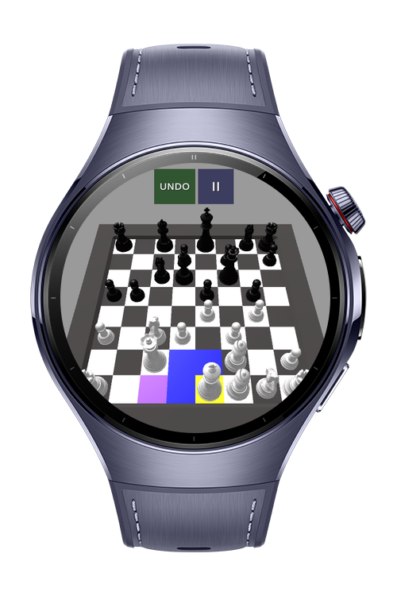
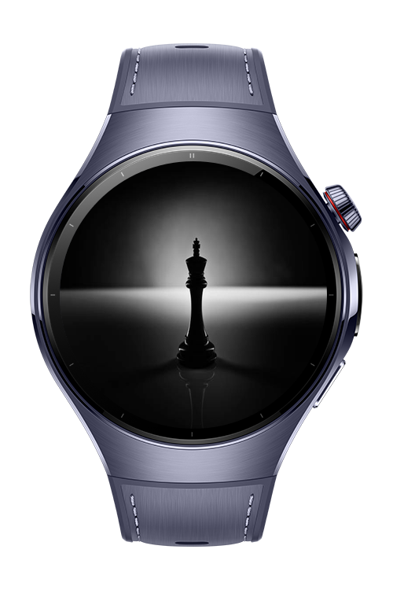
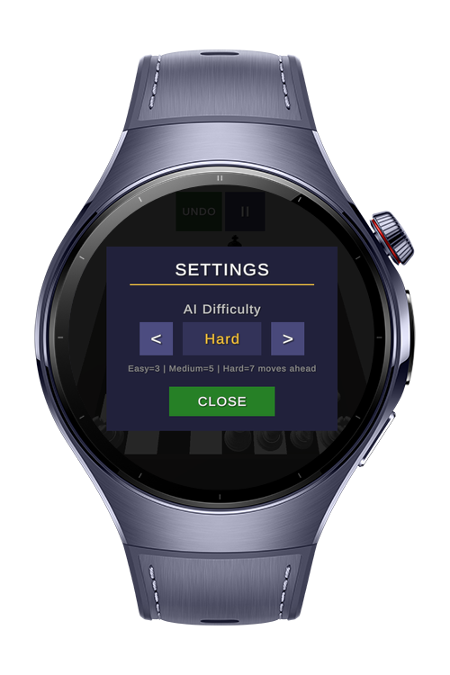

> **Note:** To access all shared projects, get information about environment setup, and view other guides, please visit [Explore-In-HMOS-Wearable Index](https://github.com/Explore-In-HMOS-Wearable/hmos-index).

# Chess Smart

Chess Smart is a smartwatch chess game built with Unity China (Tuanjie Hub OpenHarmony build) and running on HarmonyOS smart wearable devices. Play against a chess AI powered by MiniMax and Alpha-beta pruning, with highlighted tile feedback for every move, all optimized for the watch screen.

# Preview

    
    
    
    

# Use Cases

* **Main Game Page**: Play chess against the AI in Human vs Computer mode
* **Move Highlighting**: Tile colors indicate selected pieces, walkable paths, capturable opponents, en passant / castling moves, and king-in-check state

# Tech Stack

* **Languages**: C#, ArkTS
* **Game Engine**: Unity China (Tuanjie Hub, OpenHarmony Player build)
* **AI Algorithms**: MiniMax, Alpha-beta pruning
* **Runtime / Platform**: OpenHarmony / HarmonyOS smart wearable environment

# Constraints and Restrictions

## Supported Devices

* Huawei Watch 5

# License

**Chess Smart** is distributed under the terms of the MIT License.
See the [LICENSE](./LICENSE) for more information.
